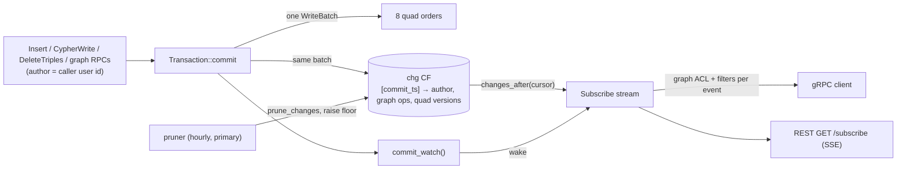

# Change feed — `Subscribe` (plan step 7, WS6) — design note

Status: **built** on branch `db/ws6-subscribe`; decisions A–G approved as
proposed (2026-09-30).

## Why not tail the WAL directly

The plan (§6.1) builds `Subscribe` on the existing WAL stream. In practice:

- A WAL entry is a raw RocksDB `WriteBatch`. The Rust binding's batch
  iterator (`rocksdb` 0.22) reports only key/value pairs — **not the column
  family** — and doesn't expose column-family ids. Every quad version is
  written to 8 orders with 48-byte keys, so without the CF we can't tell
  which order (and so which slots) a key encodes. Decoding would mean
  re-implementing the WriteBatch format and guessing CF ids.
- The WAL doesn't say **who** wrote a change or **what operation** it was
  (a graph drop is just N closing versions).
- Resume depends on WAL retention (1 h / 512 MB), which is tuned for
  replication, not for consumers that may be down for a day.

## Proposal

1. **Change-log CF `chg`**, written in the same `WriteBatch` as the commit
   (so it is exactly as durable and atomic as the data, and replicates to
   replicas through the existing WAL stream). One entry per commit:
   key `[commit_ts:8]`, value = the commit's change record:
   author (user id or empty), operation markers, and each quad version
   written (`s, p, o|value-ref, g, vt_start, vt_end`, edge id).
   Large values are referenced by their content hash (`blob` CF), not
   copied.
2. **`Subscribe` RPC** (server streaming) reads `chg` from the resume point,
   then follows new commits (in-process notification on the primary; a short
   poll on replicas). Events:

   ```protobuf
   message SubscribeRequest {
     repeated string graphs     = 1; // empty = every readable graph
     repeated string predicates = 2;
     repeated string types      = 3; // subject's current __type / rdf:type
     int64  resume_after_ts     = 4; // 0 = from now
     bool   include_values      = 5;
     string user_id             = 6;
   }
   message ChangeEvent {
     int64  commit_ts = 1;           // resume token
     string graph     = 2;
     ChangeKind kind  = 3;           // ASSERT | CLOSE | GRAPH_CREATED | GRAPH_DROPPED | GRAPH_COPIED
     Triple quad      = 4;           // unset for graph-level events
     string author    = 5;
   }
   ```

3. **ACL per event** with the subscriber's readable-graph bitmap, refreshed
   whenever the access index rebuilds — a revoked grant stops the flow
   mid-stream.
4. **REST**: `GET /subscribe` as Server-Sent Events (`id:` = commit ts, so
   `Last-Event-ID` resumes).

## Decisions needed

| # | Question | Recommendation |
|---|----------|----------------|
| A | Event source | The `chg` change-log CF above (additive CF, no migration of existing data), not WAL parsing. |
| B | Resume token | Commit timestamp (`tt`, unique and increasing per commit) instead of WAL sequence number; resuming before the oldest retained entry → `OUT_OF_RANGE`, client re-syncs. |
| C | Retention | `chg` entries older than **7 days** are pruned by the existing retention scheduler; `--change-retention-secs` / TOML `[storage] change_retention_secs` to tune (0 = keep forever). |
| D | Author | Record the caller's user id on each commit (empty for service calls) so events carry `author` — needed for notifications and audit. |
| E | Granularity | One event per quad version (`ASSERT` for open-ended, `CLOSE` for deletes / replaced values / drops), plus one graph-level event for create / drop / copy / move so consumers needn't infer them. `PROMOTE` waits for the proposal RPCs (step 8). |
| F | `types` filter | Matched against the subject's **current** `__type` (type cache) at delivery time, not its type at commit time. Cheap; good enough for workers. |
| G | Write cost | Accept one extra put per commit (~+12% write bytes on the 8-order layout); benchmark and report in the PR. No backfill: the feed starts at the upgrade. |

Out of scope here: per-node fine-grained filters beyond predicates/types,
exactly-once delivery (consumers dedupe by `commit_ts`).

## As built



- Storage (`polargraph-storage::changes`): `stage_writes` reports every quad
  version it stages (including the closing versions a `Replace` writes);
  `Transaction::commit` appends one `chg` entry with them, the author
  (`set_author`) and graph ops (`record_graph_op`). `create_graph_by`,
  `drop_graph_by`, `copy_graph_by`, `move_graph_by` record `Created`,
  `Dropped`, `Copied` (a move is `Dropped(target)` + `Copied` +
  `Dropped(source)`). `changes_after`, `changes_floor`, `prune_changes`,
  `commit_watch`.
- Server: `Subscribe` (resume via `resume_after_ts`, `OUT_OF_RANGE` below the
  floor), `--change-retention-secs` (default 604800; 0 = forever) with an
  hourly pruner on the primary. Graphs created implicitly by writes go
  through `create_graph`, so they log `GRAPH_CREATED` too.
- REST: `GET /subscribe?graphs=&predicates=&types=&include_values=&resume_after=`
  (or `Last-Event-ID`), SSE frames `id: <commit_ts>`, `event: <kind>`,
  `data: <json>`; 410 for an expired resume point; 15 s keep-alives.

Not logged: bulk SST import, `polargraphd migrate`, OWL materialization,
retention deletes, RDF-star annotations, vector inserts.

## Write cost (decision G)

Measured on Apple M-series, release build, 10 000 quads (half relations,
half text properties) in 100 commits:

| | WAL bytes | wall time (3 runs) |
|---|---|---|
| `main` (no change log) | 14 125 101 | 115 / 99 / 98 ms |
| this branch | 15 470 138 (**+9.5 %**) | 111 / 100 / 106 ms |

Criterion `triple_writes` (one commit of N properties, store opened per
iteration), branch vs `main` baseline: N = 1 and 10 −9 % / −7 % (noise, not
a real speed-up), N = 100 and 1 000 no significant change (p = 0.81, 0.44).
The extra put per commit adds ~9.5 % write volume and no measurable latency.
