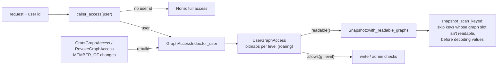

# Graph-level access control (plan step 6, §2.8) — design note

Status: **built** on branch `db/ws2-graph-acl`. Decisions approved by Mark
on 2026-09-30: A changed to "always enforced, no flag"; B–F and the `roaring`
dependency as proposed. Upgrade path and release note:
[`docs/upgrade-graph-acl.md`](../upgrade-graph-acl.md).

## Trust model

**The engine trusts the user id the calling application sends** (`user_id`,
`x-polargraph-user-id`, REST `X-User-Id`) and enforces graph access for that
id. It does not authenticate users: **the application is responsible for
authentication** and must forward only ids it has verified. The API key
authenticates the application; a call without a user id is a trusted
service call with full access. Verified identity (JWT from an IdP) is the
first item on the "Later / nice-to-have" list in `docs/STATUS.md`
(Mark, 2026-10-08: "for now we trust what the app sends").

## Before

- Identity is `user_id` / `x-polargraph-user-id` (REST `X-User-Id`),
  **asserted by the client**; the API key authenticates the service.
- `AccessCache: HashMap<user, HashSet<NodeId>>` (from `MEMBER_OF`,
  `HAS_ACCESS`, `HAS_ACCESS_TYPE`) post-filtered results of only `Query`,
  `CypherQuery`, `VectorSeedQuery`, `SearchVectorFiltered`.
- A request with no user, or a user with no grants, saw everything.

## Decisions

| # | Decision |
|---|----------|
| A | **Always enforced** for requests carrying a user id; no flag. Breaking for user-scoped callers — see the upgrade guide. |
| B | Requests **without** a user id are trusted service calls (full access). |
| C | A user with no graph grants sees only the default graph (deny by default). |
| D | The default graph is readable and writable by everyone. The system graph `urn:pg:graph:meta` is never readable through grants; users see graph metadata only via `ListGraphs` for graphs they can read. |
| E | A grant is one `HAS_GRAPH_ACCESS` edge per principal and graph, with the level as the edge annotation `GRAPH_ACCESS_LEVEL`, managed through RPCs. |
| F | Reads everywhere + write/admin checks when a user id is present. `propose` is stored now and used by the proposal RPCs (step 8). Binding users to API keys is out of scope. |

## As built

- **Grants** (`polargraph-storage::graph_acl`): `grant_graph_access`,
  `revoke_graph_access` (bitemporal close), `graph_grants`. The grant edge id
  is deterministic (`term::edge_id_for(principal, HAS_GRAPH_ACCESS, graph)`),
  so a re-grant replaces the level. Grants live in the system graph.
- **Index**: `GraphAccessIndex::build` folds each principal's own grants and
  its groups' grants (`MEMBER_OF`, one level) into `UserGraphAccess`
  (`at_least[level]` bitmaps; `readable()` adds the default graph). Rebuilt
  after grant/revoke RPCs, inserts touching `MEMBER_OF` / `HAS_GRAPH_ACCESS`,
  and user graph creation; on replicas at most every 5 s.
- **Reads**: `Snapshot` carries `Option<Arc<RoaringBitmap>>`; reads go
  through an internal `ReadAt { ts, vt_as_of, readable }`. Quad scans check
  the key's 4-byte graph slot first; single-graph scans of an unreadable graph
  return immediately; union reads de-duplicate after filtering. Text search,
  RDF-star annotations, property history and edge-id lookups honour the same
  bitmap. Vector hits are kept only for nodes with a live quad in a readable
  graph (restricted callers over-fetch to `max(k, ef)`).
- **Writes** (user callers): `Insert`, `CypherWrite` (`USE GRAPH` / `graph`,
  default graph otherwise), `DeleteTriples` (writable graphs only) need
  `write`; a user's `CreateGraph` of a new graph grants it `admin`;
  metadata changes, copy/move into, move from and drop need `admin`; copy
  from needs `read`. Unknown graphs are `PERMISSION_DENIED`, never created.
  Access-control predicates (`MEMBER_OF`, `HAS_ACCESS*`, `HAS_GRAPH_ACCESS`,
  `GRAPH_ACCESS_LEVEL`) and the node-ACL RPCs are service-only.
- **REST**: middleware puts `X-User-Id` in a task-local that the gRPC
  interceptor forwards on every upstream call; `/graphs/access` manages
  grants.
- Node-level grants (`HAS_ACCESS`) still post-filter on top, as before.

## Known limits

- The user id is client-asserted (REST: any client that omits `X-User-Id` is
  a service call) — deploy behind a trusted front end.
- `InsertVector` / `BatchInsertVectors` aren't graph-scoped; vectors are only
  filtered on read.
- `ResolveIris`, `ExplainQuery`, `ShowIndexes`, `ShowStats` and operator RPCs
  (backup, retention, migration, materialization) don't consult the graph
  ACL.
- Group nesting is one level (user → group), as with the node ACL.
